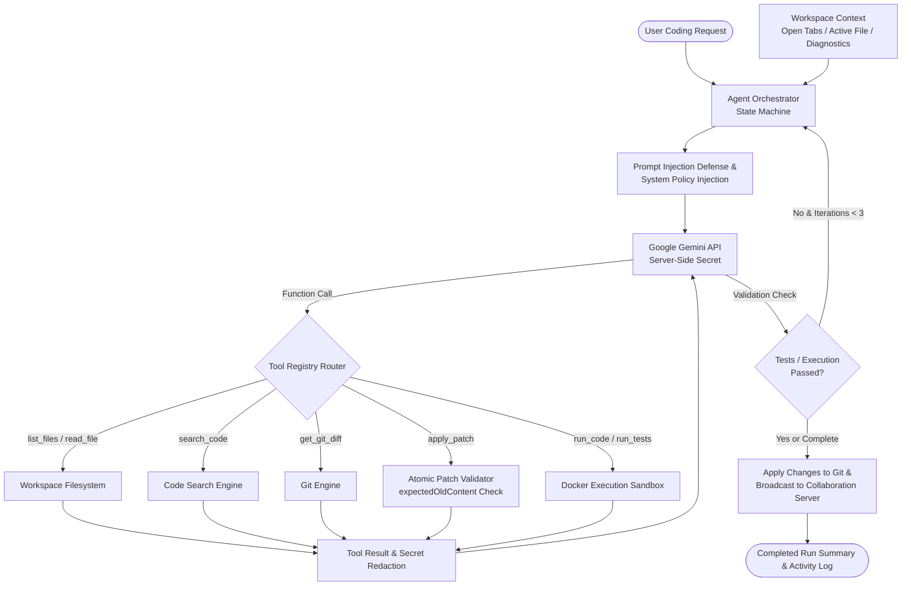
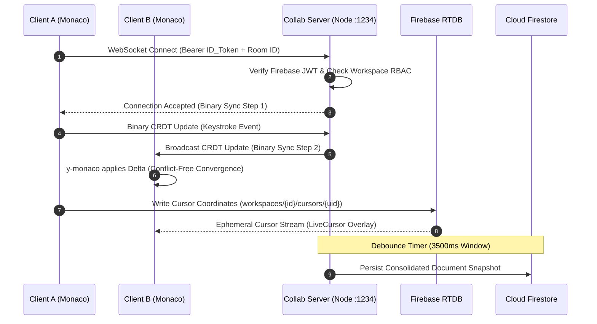
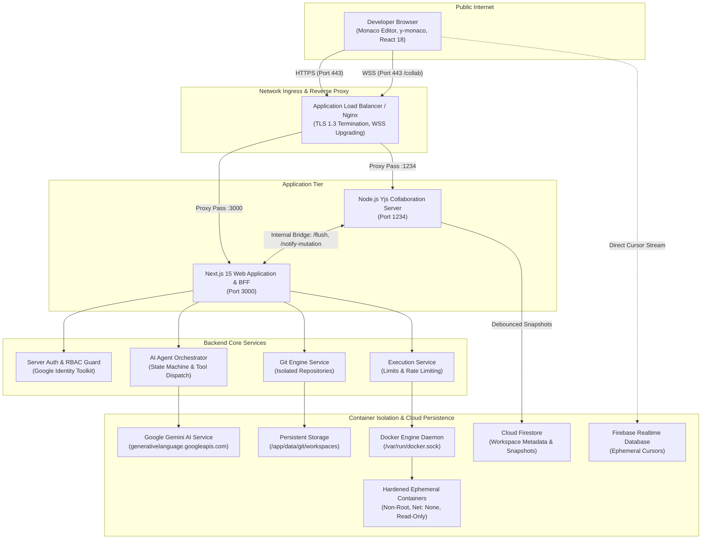
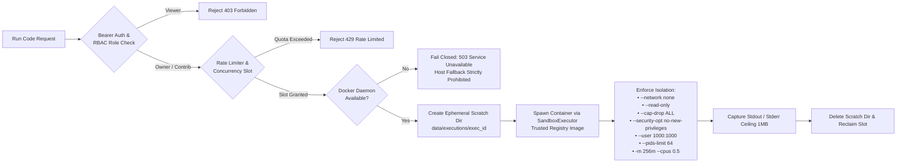
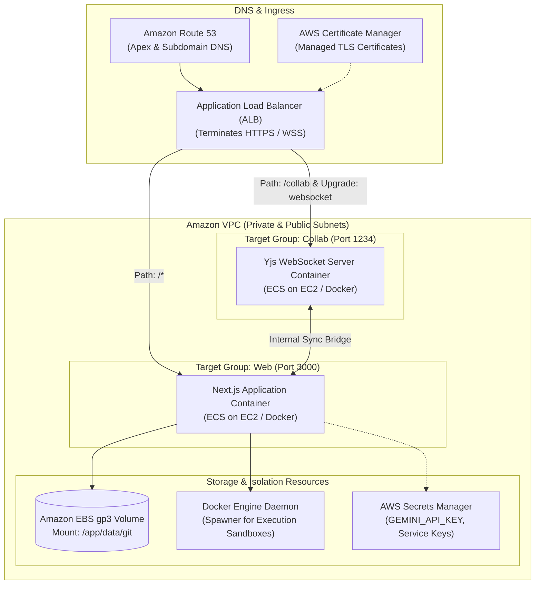

# CodeCraft

> **AI-Assisted Collaborative Development Platform**

[](https://github.com/Himanshusekharsahoo/CodeCraft/releases)
[](https://nextjs.org/)
[](https://react.dev/)
[](https://nodejs.org/)
[](./LICENSE)

CodeCraft is an AI-assisted collaborative browser-based development environment engineered to unify real-time code editing, multi-file workspace management, containerized sandboxed code execution, server-side Git version control, and autonomous AI coding agents into a single developer platform.

Built with **Next.js 15**, **React 18**, **Monaco Editor**, **Yjs CRDT**, a dedicated **Node.js WebSocket Collaboration Server**, **Docker Engine**, **Firebase Authentication**, **Cloud Firestore**, and **Google Gemini**, CodeCraft delivers a full-featured IDE experience directly in the browser with strict multi-tenant isolation, role-based access control, and defense-in-depth sandbox security.

---

## Overview

Modern software engineering frequently fragments developer attention across disjointed web applications, terminal windows, local text editors, and separate chat interfaces. Developers find themselves constantly switching contexts between local runtimes, cloud repositories, AI prompt interfaces, and real-time collaboration tools.

**CodeCraft** addresses this fragmentation by integrating the full software lifecycle into a production-ready cloud IDE. Workspaces are structured around real POSIX-compliant multi-file directories stored in Cloud Firestore and mirrored to isolated on-host Git repositories, providing developers with familiar file trees, tabbed editing, and visual version control.

Concurrent engineering is powered by conflict-free replicated data types (Yjs CRDTs) connected to a dedicated high-throughput WebSocket service, enabling sub-millisecond character convergence, shared editor state, and live cursor awareness across distributed team members. Local offline changes are indexed in browser storage and seamlessly synchronized upon reconnection.

To protect host environments, CodeCraft replaces unconstrained remote third-party runners with a hardened **Docker Sandbox Execution Engine**. Code execution is performed within transient, ephemeral Linux containers governed by non-root execution, immutable runtime registries, CPU and memory quotas, process limits, and total network isolation. Meanwhile, an integrated **AI Coding Agent** leverages Google Gemini to autonomously inspect project trees, compute diffs, apply atomic patches, and execute sandboxed validation tests with bounded self-repair loops.

---

## ✨ Key Features

### 🧑‍💻 Code Editor
- **Monaco Engine**: Powered by `@monaco-editor/react`, bringing the Visual Studio Code editor experience to the web.
- **Syntax Highlighting & Language Intelligence**: Built-in support for JavaScript, TypeScript, Python, Java, C, C++, PHP, HTML, CSS, JSON, SQL, and Markdown.
- **Multi-Tab Workspace**: Open, edit, and navigate multiple files concurrently with preserved tab history and active file tracking.
- **Theming & Customization**: Dynamic dark and light themes powered by `next-themes` with responsive font sizing and custom minimap controls.
- **Safety Auditing**: Automatic detection and rejection of oversized files (>128 KB) and binary assets to protect browser responsiveness.

### 📁 Multi-File Workspace Management
- **Hierarchical File Tree**: Full create, rename, delete, and navigation capabilities for nested files and directories via `Navpanel.jsx`.
- **Durable Metadata Persistence**: Workspaces, directories, and file metadata are managed in Cloud Firestore with role-based document security rules.
- **Safe Traversal Controls**: Guardrails against directory loops, recursive path nesting, and path traversal sequences (`../`, null bytes).
- **Workspace Dashboard**: Comprehensive dashboard for creating, browsing, sorting, inviting collaborators, and managing member permissions.

### 👥 Real-Time Collaboration
- **Conflict-Free Replicated Data Types (CRDT)**: Implemented using Yjs binary protocol and `y-monaco` bindings for concurrent zero-conflict typing.
- **Dedicated WebSocket Server**: Standalone Node.js service (`collaborationserver`) running on port 1234, managing room lifecycle and awareness.
- **Live Cursor Presence**: Ephemeral collaborator presence, cursor coordinates, and custom collaborator color palettes powered by Firebase Realtime Database.
- **Graceful Disconnect Cleanup**: Automated server-side presence eviction via `onDisconnect()` handlers when network drops or browser tabs close.
- **Debounced Persistence**: In-memory Yjs updates are debounced (3.5s window) before committing snapshots to Firestore, optimizing write operations.
- **Offline Resilience**: Integrated with `y-indexeddb` for local browser caching and conflict-free convergence upon reconnection.

### 🧠 Autonomous AI Coding Agent
- **Repository-Aware Intelligence**: Server-side Google Gemini integration equipped with a deterministic tool-calling engine.
- **Comprehensive Tool Registry**: Tools include `list_files`, `read_file`, `search_code`, `get_git_diff`, `apply_patch`, `run_code`, and `run_tests`.
- **Bounded Self-Repair Loop**: Automatically detects compile errors or test failures and triggers autonomous repair cycles (bounded to a maximum of 3 iterations).
- **Safe Rollback**: Snapshots workspace state prior to execution and offers single-click or automatic atomic rollback if changes fail validation.
- **Security Boundaries**: Prompt injection defense with passive XML delimiter isolation, regex-based secret redaction, and strict path boundary checks.

### 🌿 Server-Side Git Version Control
- **Isolated Workspace Repositories**: Pure Node.js `GitService` managing isolated Git repositories in `/data/git/workspaces/{workspaceId}`.
- **Full Version Control Lifecycle**: Initialize repositories, stage/unstage files, commit changes, inspect commit history, and examine detailed diffs.
- **Branch Management**: Create, switch (checkout), and delete branches directly from the IDE interface.
- **Merge & Conflict Resolution**: Branch merge operations with structured conflict markers and visual resolution workflows.
- **Dual-Sync Bridge**: Two-way synchronization between the on-disk Git working tree, the Firestore document store, and active Yjs collaboration rooms.

### ▶️ Hardened Sandbox Code Execution
- **Zero Host Execution**: All code runs exclusively inside ephemeral, strictly isolated Docker containers.
- **Trusted Runtime Registry**: Immutable runtime specifications for Node.js, TypeScript (native Node 22 type stripping), Python 3, Java 17 Temurin, GCC 13 C/C++, and PHP 8.3.
- **Defense-in-Depth Isolation**: Containers run with `--network none`, `--read-only`, `--cap-drop ALL`, `--security-opt no-new-privileges`, and non-root users (`1000:1000`).
- **Strict Resource Quotas**: Enforced ceilings for CPU (0.5 core), memory (256 MB default, 512 MB hard ceiling), processes (`--pids-limit 64`), and timeouts (8s execution, 10s compilation).
- **Fail-Closed Design**: If the Docker daemon is unreachable, the system fails closed with HTTP 503 rather than attempting unisolated host execution.

### 🔐 Authentication & RBAC
- **Firebase Auth Integration**: User authentication supporting email/password and federated identity providers with Google Identity Toolkit token verification.
- **Workspace RBAC Matrix**: Enforces strict privilege tiers across **Owner**, **Contributor**, and **Viewer** roles.
- **Viewer Restrictions**: Viewer accounts are strictly forbidden from running code (HTTP 403), performing Git operations (HTTP 403), or triggering AI modifications (HTTP 403).
- **Ownership Invariants**: Sole owners are prevented from abandoning workspaces without explicitly transferring ownership or deleting the workspace.

### 🔍 Diagnostics & Observability
- **Monaco Problems Integration**: Standardized error markers directly placed on the editor surface for compilation failures and runtime tracebacks.
- **Centralized Error Taxonomy**: 16-code normalized taxonomy across Auth, Execution, Git, AI, and Collaboration layers.
- **Structured JSON Logging**: Request tracing with deep data scrubbing to prevent credential leakage in application logs.
- **Health & Readiness Probes**: `/api/health` probes container daemon availability, collaboration server connectivity, and system liveness.

### ☁️ Production Infrastructure & IaC
- **Multi-Stage Docker Builds**: Production-optimized container images for both the Next.js frontend (`Dockerfile.web`) and the collaboration service (`Dockerfile.collab`).
- **AWS CloudFormation Blueprint**: Complete infrastructure-as-code template defining VPC, ALB, ECS/EC2 clusters, EBS volumes, and IAM least-privilege roles.
- **Reverse Proxy**: Nginx configuration terminating TLS 1.2/1.3, managing WebSocket upgrades, and enforcing Content Security Policy headers.
- **Zero-Downtime Deployment & Rollback**: Shell automation scripts (`deploy.sh`, `rollback.sh`, `healthcheck.sh`) ensuring safe releases with health gatekeepers.

---

## 🧠 AI Coding Agent

CodeCraft features an integrated AI Coding Agent that operates as an autonomous pair programmer inside the authorized workspace. The agent runs strictly server-side using the official Google Gemini SDK (`@google/generative-ai`) and communicates through an orchestration state machine.



### Approved Tool Capabilities

The agent operates strictly within a whitelist of server-defined tools declared in [`src/lib/ai/tools/registry.js`](file:///C:/Users/HP/Desktop/Colleborative_ai_based_code-editor-main/src/lib/ai/tools/registry.js):

| Tool Name | Parameters | Operational Scope |
| :--- | :--- | :--- |
| `list_files` | `path` *(optional)* | Scans directory tree within workspace bounds (max 20 entries per call). |
| `read_file` | `path` *(required)* | Reads sanitized file contents up to 128 KB; rejects binary assets and sensitive files (`.env`, `.git`). |
| `search_code` | `query` *(required)*, `path` *(optional)* | Searches string patterns and identifiers across workspace files; returns line numbers and bounded snippets. |
| `get_git_diff` | `path` *(optional)* | Generates unified Git diffs of modified working tree files to inspect pending changes. |
| `apply_patch` | `file`, `expectedOldContent`, `patch` | Atomically replaces or creates file contents with strict pre-condition verification to prevent concurrent edit overwrites. |
| `run_code` | `language`, `source`, `files`, `stdin` | Dispatches code execution to the isolated Docker sandbox via `ExecutionService`. |
| `run_tests` | `testName` *(required)* | Executes approved project test suites (`test:execution`, `test:git`, `test:security`, `test:collab`) inside sandboxed environments. |

### Operational Limits & Guardrails

- **Bounded Self-Repair**: If a test or execution fails after applying a patch, the agent initiates self-repair up to a hard ceiling of **3 iterations**.
- **Execution Ceilings**: Maximum 25 total tool calls, 5 Docker code executions, and 10 touched files per agent run.
- **Hard Timeout**: Agent runs are strictly terminated after **90 seconds** to avoid runaway processes.
- **Safe Rollback Service**: Every agent run captures pre-execution working tree snapshots (`preRunSnapshots`). If an execution encounters fatal errors or the user clicks "Rollback", [`SafeRollbackService`](file:///C:/Users/HP/Desktop/Colleborative_ai_based_code-editor-main/src/lib/ai/safeRollback.js) restores all files to their exact pre-run state.
- **Secret Redaction**: All tool outputs, prompts, and log messages pass through [`secretRedaction.js`](file:///C:/Users/HP/Desktop/Colleborative_ai_based_code-editor-main/src/lib/ai/secretRedaction.js), stripping Bearer tokens, private keys, and credential strings.

---

## 👥 Real-Time Collaboration

CodeCraft implements multi-user collaborative editing using **Yjs**—a high-performance Conflict-Free Replicated Data Type (CRDT) framework—paired with a dedicated WebSocket service.



### Collaboration Architecture Details

1. **Dedicated Service Separation**: Real-time WebSocket traffic is completely offloaded from the Next.js HTTP server to an independent Node.js process (`collaborationserver/src/server.js`), guaranteeing that heavy HTTP requests do not block real-time message dispatch.
2. **Binary CRDT Wire Protocol**: Updates are transmitted as compact binary payloads using `y-websocket` and `y-protocols`, minimizing network serialization overhead.
3. **Room & Memory Management**: Rooms are dynamically created per file (`${workspaceId}_${fileId}`). When all clients leave a room, an eviction timer frees the in-memory `Y.Doc` instance to prevent memory leaks.
4. **Presence & Awareness**: Collaborator cursors are rendered in real time using `LiveCursor.jsx`. Presence metadata is bound to Firebase Realtime Database with strict validation rules preventing position tampering. Server-side `onDisconnect` handlers guarantee cursor cleanup during abnormal network disconnections.
5. **Dual-Sync Bridge**: When external file mutations occur outside the WebSocket room (e.g., an AI agent patch or a Git branch checkout), Next.js invokes `POST /notify-mutation` with an internal service secret (`COLLAB_INTERNAL_SECRET`), ensuring in-memory CRDT documents reflect disk mutations immediately without requiring client page reloads.

---

## 🏗️ System Architecture

The following diagram illustrates the complete CodeCraft production system architecture, detailing data flow and security boundaries:



---

## ▶️ Secure Code Execution

CodeCraft implements a hardened, defense-in-depth container execution architecture designed to execute untrusted user code safely without exposing the host system.



### Trusted Runtime Registry

Client requests cannot specify custom Docker images or arbitrary shell commands. All execution is strictly bound to the immutable runtime configurations defined in [`src/lib/execution/runtimeRegistry.js`](file:///C:/Users/HP/Desktop/Colleborative_ai_based_code-editor-main/src/lib/execution/runtimeRegistry.js):

| Language | Identifier / Aliases | Pinned Docker Image | Default File | Execution Command | Memory / Timeout |
| :--- | :--- | :--- | :--- | :--- | :--- |
| **JavaScript** | `javascript`, `js`, `node` | `node:20-alpine` | `main.js` | `node --max-old-space-size=200 main.js` | 256 MB / 8.0s |
| **TypeScript** | `typescript`, `ts` | `node:22-alpine` | `main.ts` | `node --no-warnings --experimental-strip-types main.ts` | 256 MB / 8.0s |
| **Python** | `python`, `py`, `python3` | `python:3.11-alpine` | `main.py` | `python3 -u main.py` | 256 MB / 8.0s |
| **Java** | `java` | `eclipse-temurin:17-alpine` | `Main.java` | `javac Main.java` && `java -Xmx200m Main` | 384 MB / 10.0s |
| **C++** | `cpp`, `c++` | `gcc:13-alpine` | `main.cpp` | `g++ -O2 -std=c++17 -o main main.cpp` && `./main` | 256 MB / 10.0s |
| **C** | `c` | `gcc:13-alpine` | `main.c` | `gcc -O2 -std=c11 -o main main.c` && `./main` | 256 MB / 10.0s |
| **PHP** | `php` | `php:8.3-cli-alpine` | `main.php` | `php main.php` | 256 MB / 8.0s |

### Security Invariants & Isolation Controls

- **Fail-Closed Availability Check**: [`dockerDetector.js`](file:///C:/Users/HP/Desktop/Colleborative_ai_based_code-editor-main/src/lib/execution/dockerDetector.js) probes Docker availability before each execution. If the daemon is unreachable, the system fails closed with HTTP 503 (`EXECUTION_SANDBOX_UNAVAILABLE`). Falling back to host process execution is strictly prohibited.
- **Zero Network Egress**: Containers are launched with `--network none`, completely preventing outbound data exfiltration, reverse shells, or botnet communication.
- **Non-Root User Enforcement**: Containers run with `--user 1000:1000` (dynamic runner UID/GID), barring root privilege escalation within the container.
- **Linux Capability Stripping**: Invoked with `--cap-drop ALL` and `--security-opt no-new-privileges`, preventing privilege escalations via `setuid` binaries.
- **Read-Only Root Filesystem**: Mounted with `--read-only`. Only the temporary execution working directory (`/app`) and an ephemeral 64 MB tmpfs (`/tmp:rw,noexec,nosuid,size=64m`) are writable.
- **Resource Limits (cgroups)**: Enforces strict limits: default 256 MB RAM (512 MB max), 0.5 CPU shares, and a maximum of 64 processes (`--pids-limit 64`) to neutralize fork bombs.
- **Execution Quotas**:
  - Max source code size: 256 KB
  - Max stdin payload: 64 KB
  - Max multi-file payload: 20 files (512 KB aggregate)
  - Max stdout/stderr output: 1 MB combined ceiling
  - Rate limiting: 20 executions/minute per user; max 2 concurrent executions per user; max 10 concurrent executions globally.
- **Path Traversal Defense**: All relative file paths submitted in multi-file executions are checked against directory traversal (`../`), POSIX root prefixes, Windows drive prefixes (`C:`), null bytes, and sensitive path tokens (`.git`, `.env`, `passwd`).
- **Orphan Container Reaper**: The [`orphanReaper.js`](file:///C:/Users/HP/Desktop/Colleborative_ai_based_code-editor-main/src/lib/execution/orphanReaper.js) utility automatically identifies and purges abandoned or hanging containers matching the label `codecraft.execution=true`.

---

## 🔐 Security

Security is designed into CodeCraft across all architectural boundaries. Detailed forensic verification is documented in [`docs/FINAL_FORENSIC_AUDIT_REPORT.md`](file:///C:/Users/HP/Desktop/Colleborative_ai_based_code-editor-main/docs/FINAL_FORENSIC_AUDIT_REPORT.md) and [`docs/PRODUCTION_READINESS_REPORT.md`](file:///C:/Users/HP/Desktop/Colleborative_ai_based_code-editor-main/docs/PRODUCTION_READINESS_REPORT.md).

### Summary of Security Controls

1. **Authentication Verification**: All protected Next.js API routes validate Firebase ID tokens against Google Identity Toolkit REST endpoints using [`src/lib/serverAuth.js`](file:///C:/Users/HP/Desktop/Colleborative_ai_based_code-editor-main/src/lib/serverAuth.js). Mock test tokens (`test-token-*`) are unconditionally rejected when `NODE_ENV === 'production'` via [`src/lib/authEnv.js`](file:///C:/Users/HP/Desktop/Colleborative_ai_based_code-editor-main/src/lib/authEnv.js).
2. **Workspace RBAC**: Every mutating endpoint validates membership in `workspaces/{workspaceId}/members/{userId}`. Viewers are blocked with HTTP 403 from executing code, modifying files, executing Git operations, or triggering AI agents.
3. **Server-Side AI Secrets**: The `GEMINI_API_KEY` credential is kept strictly server-side. It is never prefixed with `NEXT_PUBLIC_` and is never included in client JavaScript bundles.
4. **Content Security Policy (CSP)**: Configured in [`next.config.mjs`](file:///C:/Users/HP/Desktop/Colleborative_ai_based_code-editor-main/next.config.mjs) with strict origin restrictions while explicitly permitting required Monaco Editor worker scripts (`blob:`, `'unsafe-eval'`) and Yjs WebSocket endpoints (`ws:`, `wss:`).
5. **HTTP Defense Headers**:
   - `Strict-Transport-Security: max-age=63072000; includeSubDomains; preload`
   - `X-Frame-Options: SAMEORIGIN` (Clickjacking prevention)
   - `X-Content-Type-Options: nosniff` (MIME sniffing defense)
   - `Referrer-Policy: strict-origin-when-cross-origin`
   - `Permissions-Policy: camera=(), microphone=(), geolocation=()`
6. **Firestore & RTDB Security Rules**: [`firestore.rules`](file:///C:/Users/HP/Desktop/Colleborative_ai_based_code-editor-main/firestore.rules) prevents client-side forging of system messages (`userId === 'AI_BOT'` is rejected), while [`database.rules.json`](file:///C:/Users/HP/Desktop/Colleborative_ai_based_code-editor-main/database.rules.json) enforces fail-closed defaults (`.read: false, .write: false`) and strictly permits cursor updates only to matching authenticated users (`auth.uid === $userId`).
7. **Internal Service Authentication**: Communication between the web server and the collaboration server (such as `/flush` and `/notify-mutation`) is protected by a mandatory shared secret token (`COLLAB_INTERNAL_SECRET`).

---

## 🧰 Tech Stack

| Category | Technology | Version / Specification | Purpose |
| :--- | :--- | :--- | :--- |
| **Frontend Framework** | **Next.js** | `15.1.6` (App Router) | Core web application framework and API routes |
| **UI Library** | **React** | `18.3.1` | Component architecture and state management |
| **Code Editor** | **Monaco Editor** | `@monaco-editor/react ^4.6.0` | In-browser code editing, syntax highlighting, diffs |
| **Styling** | **Tailwind CSS** | `3.4.1` | Responsive utility-first styling and theme tokens |
| **UI Components** | **Radix UI / Chakra UI** | `@radix-ui/*`, `@chakra-ui/react ^3.5.1` | Accessible modals, dialogs, drawers, and menus |
| **Icons & Animations** | **Lucide / Framer Motion** | `lucide-react ^0.474.0`, `framer-motion ^12.0.8` | Consistent iconography and fluid UI animations |
| **CRDT Engine** | **Yjs** | `13.6.32` | Shared data types for conflict-free document convergence |
| **Editor CRDT Binding**| **y-monaco** | `0.1.6` | Synchronizes Monaco text models with Yjs `Y.Text` types |
| **Offline Storage** | **y-indexeddb** | `9.0.12` | Local IndexedDB persistence for offline edit buffering |
| **Collab Server** | **Node.js + ws** | `ws ^8.18.0` / `ws ^8.21.3` | Standalone WebSocket room server and awareness gateway |
| **Wire Protocol** | **y-protocols / lib0** | `y-protocols ^1.0.6`, `lib0 ^0.2.98` | Binary state vector exchange and CRDT messaging |
| **AI SDK** | **Google Gen AI** | `@google/generative-ai ^0.21.0` | Official Google Gemini SDK for autonomous agent workflows |
| **Authentication** | **Firebase Auth** | `11.2.0` | User account management and token issuance |
| **Database** | **Cloud Firestore** | `11.2.0` (Web SDK) | Persistent document metadata, workspace index, file storage |
| **Live Presence** | **Firebase RTDB** | `11.2.0` (Web SDK) | Ephemeral collaborator cursor positions and awareness |
| **Container Engine** | **Docker Engine** | Docker CLI / Daemon | Ephemeral sandbox execution environments |
| **Version Control** | **Git (Native)** | Node.js child_process | Workspace-isolated server-side Git repository management |
| **Testing** | **Node.js Test Runner**| Built-in `node:test` / assert | Backend integration, security, and regression test suites |
| **E2E Testing** | **Playwright** | `@playwright/test ^1.63.0` | Multi-browser end-to-end integration testing |

---

## 📂 Project Structure

```text
CodeCraft/
├── .env.example               # Centralized environment variable template
├── components.json            # Shadcn UI configuration
├── database.rules.json        # Firebase Realtime Database cursor presence security rules
├── docker-compose.yml         # Development multi-container orchestration
├── docker-compose.prod.yml    # Production container orchestration
├── firestore.rules            # Firestore RBAC and security rules
├── LICENSE                    # MIT License
├── next.config.mjs            # Next.js standalone build & Content Security Policy configuration
├── package.json               # Project manifest, dependencies, and test commands
├── playwright.config.js       # Playwright browser integration test configuration
│
├── collaborationserver/       # Dedicated Yjs WebSocket Collaboration Server
│   ├── package.json           # Collaboration server dependencies (ws, yjs, lib0)
│   ├── src/
│   │   ├── auth.js            # Firebase ID token verification
│   │   ├── authorization.js   # Workspace RBAC verification
│   │   ├── config.js          # Collab configuration, ports, and resource bounds
│   │   ├── logger.js          # Structured event logging
│   │   ├── persistence.js     # Debounced Firestore snapshot persistence engine
│   │   ├── rooms.js           # Y.Doc room lifecycle and awareness manager
│   │   └── server.js          # HTTP/WebSocket server, health probes, and internal bridge
│   └── test/
│       └── test-collaboration.js # Collab test suite (CRDT sync, rooms, presence)
│
├── deployment/                # Production Deployment & Infrastructure-as-Code
│   ├── aws/
│   │   ├── architecture.md    # AWS deployment blueprint and architecture specification
│   │   ├── cloudformation.yml # Production multi-AZ VPC, ALB, ECS, EBS CloudFormation template
│   │   └── task-definition.json # Dual-container ECS task definition (web + collab)
│   ├── docker/
│   │   ├── Dockerfile.web     # Multi-stage production container for Next.js web application
│   │   └── Dockerfile.collab  # Production container for Yjs WebSocket collaboration server
│   ├── nginx/
│   │   └── nginx.conf         # TLS reverse proxy with WebSocket upgrade support
│   ├── scripts/
│   │   ├── deploy.sh          # Zero-downtime rolling deployment script with health gating
│   │   ├── healthcheck.sh     # Standalone endpoint health validator
│   │   └── rollback.sh        # Automated data-preserving rollback script
│   └── systemd/
│       ├── codecraft-collab.service # Systemd unit file for collaboration server
│       └── codecraft-web.service    # Systemd unit file for Next.js web application
│
├── docs/                      # Architectural Documentation & Forensic Reports
│   ├── architecture/          # Developer architecture maps, data models, and specifications
│   ├── FINAL_FORENSIC_AUDIT_REPORT.md  # 50-feature forensic audit and cleanup attestation
│   ├── PERFORMANCE_OPTIMIZATION_REPORT.md # Performance benchmarks and query tuning report
│   └── PRODUCTION_READINESS_REPORT.md     # Production release attestation report
│
├── e2e/                       # Playwright Browser End-to-End Test Suite
├── public/                    # Static Web Assets & Branding
│
├── src/                       # Next.js Application Source Code
│   ├── app/                   # Next.js 15 App Router Routes
│   │   ├── api/               # Protected Backend API Routes
│   │   │   ├── health/        # Liveness and readiness health probe route
│   │   │   ├── getChatResponse/ # AI chat assistance endpoint
│   │   │   ├── auto-complete/   # AI code autocompletion endpoint
│   │   │   ├── generate-documentation/ # AI docstring generator endpoint
│   │   │   ├── get-errors/    # AI execution error analysis endpoint
│   │   │   └── workspace/[workspaceId]/ # Workspace-scoped API routes
│   │   │       ├── agent/     # AI Agent dispatch and atomic rollback routes
│   │   │       ├── execute/   # Docker execution dispatch and cancellation routes
│   │   │       ├── git/       # Git init, status, commit, branch, diff, merge routes
│   │   │       ├── invites/   # Workspace invitation management routes
│   │   │       └── route.js   # Cascading workspace deletion route
│   │   ├── dashboard/         # Authenticated User Dashboard
│   │   ├── workspace/[workspaceId]/ # Multi-file Collaborative IDE Shell
│   │   ├── (auth)/            # Login, register, forgot-password, profile, account pages
│   │   ├── layout.js          # Root HTML layout and provider wraps
│   │   └── globals.css        # Global Tailwind styling and IDE viewport rules
│   │
│   ├── components/            # React UI Components
│   │   ├── AgentPanel.jsx     # AI Agent control drawer, activity logs, and diff review
│   │   ├── Chat.jsx           # Collaborator real-time text chat
│   │   ├── Comments.jsx       # In-code comment threads and discussions
│   │   ├── Editor.jsx         # Monaco collaborative editor integration
│   │   ├── GitPanel.jsx       # Visual Git staging, commit, branch, and history panel
│   │   ├── LiveCursor.jsx     # Real-time multi-user cursor awareness overlay
│   │   ├── MonacoDiffViewer.jsx # Side-by-side Git and patch visual diff viewer
│   │   ├── Navpanel.jsx       # Multi-file directory tree and tab navigation panel
│   │   ├── Output.jsx         # Sandboxed execution terminal, stdout/stderr, and stdin
│   │   └── ...                # Reusable UI primitives (Header, Members, ErrorBoundary)
│   │
│   ├── config/                # Firebase Client SDK Configuration (Auth, Firestore, RTDB)
│   ├── context/               # React Context Providers (AuthProvider)
│   ├── helpers/               # Client-Side Authentication Helpers
│   │
│   └── lib/                   # Domain Logic, Services & Security Helpers
│       ├── ai/                # Gemini provider, agent orchestrator, tools, rollback, defense
│       ├── execution/         # SandboxExecutor, runtime registry, security, limits, reaper
│       ├── git/               # GitService, Firestore sync bridge, path security, git auth
│       ├── authEnv.js         # Production environment authentication guards
│       ├── diagnostics.js     # Monaco error marker generator
│       ├── errorUtils.js      # Centralized error normalization
│       ├── observability.js   # Structured event logging and taxonomy
│       ├── serverAuth.js      # Server-side Firebase ID token verification
│       └── workspaceHelpers.js# Workspace permissions and member resolution
│
└── test/                      # Backend Integration, Security & Regression Test Suites
    ├── agent-security.test.js # AI Agent security, tool boundaries, and prompt defense
    ├── execution-security.test.js # Docker sandbox limits, non-root, and fail-closed tests
    ├── git-engine.test.js     # Git repository lifecycle, branching, and merge tests
    ├── p1-security-remediation.test.js # P1 security fixes verification suite
    ├── workspace-isolation.test.js     # Workspace tenant isolation and RBAC tests
    └── ...                    # Regression suites (phase9 through phase13)
```

---

## 🚀 Getting Started

Follow these steps to configure and run CodeCraft in your local development environment.

### Prerequisites

- **Node.js**: `v20.x` or `v22.x` (LTS recommended)
- **npm**: `v10.x` or higher
- **Docker Desktop / Docker Engine**: Required for sandboxed code execution (ensure Docker daemon is running)
- **Firebase Project**: A Firebase project with **Authentication** (Email/Password or Google Provider enabled), **Cloud Firestore**, and **Firebase Realtime Database**
- **Google Gemini API Key**: An API key from [Google AI Studio](https://aistudio.google.com/)

---

### Clone

```bash
git clone https://github.com/Himanshusekharsahoo/CodeCraft.git
cd CodeCraft
```

---

### Install

Install dependencies for both the root Next.js application and the collaboration server:

```bash
# 1. Install root dependencies
npm install

# 2. Install collaboration server dependencies
cd collaborationserver
npm install
cd ..
```

---

### Environment Variables

Copy the template configuration file:

```bash
cp .env.example .env.local
```

Open `.env.local` and populate the values according to your environment. Configuration variables are strictly categorized by taxonomy:

```env
# ==============================================================================
# 1. AI Provider Configuration (Google Gemini)
# ==============================================================================
# [SERVER-SECRET] Server-only Gemini API Key (NEVER expose to browser)
GEMINI_API_KEY=your_gemini_api_key_here
# [INTERNAL-CONFIG] Default Gemini model identifier
GEMINI_MODEL=gemini-1.5-flash

# ==============================================================================
# 2. Firebase Client Configuration (Web SDK)
# ==============================================================================
# [PUBLIC] Client-accessible Firebase Web SDK keys
NEXT_PUBLIC_FIREBASE_API_KEY=your_firebase_api_key
NEXT_PUBLIC_FIREBASE_AUTH_DOMAIN=your_project_id.firebaseapp.com
NEXT_PUBLIC_FIREBASE_DATABASE_URL=https://your_project_id-default-rtdb.firebaseio.com
NEXT_PUBLIC_FIREBASE_PROJECT_ID=your_project_id
NEXT_PUBLIC_FIREBASE_STORAGE_BUCKET=your_project_id.appspot.com
NEXT_PUBLIC_FIREBASE_MESSAGING_SENDER_ID=your_messaging_sender_id
NEXT_PUBLIC_FIREBASE_APP_ID=your_app_id
NEXT_PUBLIC_FIREBASE_MEASUREMENT_ID=your_measurement_id

# ==============================================================================
# 3. Real-Time Collaboration Server Configuration
# ==============================================================================
# [PUBLIC] WebSocket URL for client connection (use ws:// in dev, wss:// in prod)
NEXT_PUBLIC_COLLAB_WS_URL=ws://localhost:1234
# [INTERNAL-CONFIG] HTTP URL for internal Next.js -> Collab sync bridge
NEXT_PUBLIC_COLLAB_HTTP_URL=http://localhost:1234
COLLAB_PORT=1234
COLLAB_HOST=0.0.0.0
ALLOWED_ORIGINS=http://localhost:3000
PERSISTENCE_DEBOUNCE_MS=3500
# [SERVER-SECRET] Internal bridge secret between web server and collab server
COLLAB_INTERNAL_SECRET=your_collab_internal_secret_here

# ==============================================================================
# 4. Host & Runtime Configuration
# ==============================================================================
NODE_ENV=development
PORT=3000
HOSTNAME=0.0.0.0
```

> [!WARNING]
> Never commit `.env`, `.env.local`, or any credentials to Git. Server secrets (`GEMINI_API_KEY`, `COLLAB_INTERNAL_SECRET`) must never be prefixed with `NEXT_PUBLIC_`.

---

### Run Locally

#### Option A: Running with Docker Compose (Recommended)

To launch the entire platform (Next.js web application and collaboration server) inside coordinated containers:

```bash
docker compose up --build
```

- Web Application: `http://localhost:3000`
- Collaboration Server: `ws://localhost:1234`
- Health Endpoint: `http://localhost:3000/api/health`

#### Option B: Running Local Node.js Processes

1. **Start the Collaboration Server**:
   ```bash
   cd collaborationserver
   npm start
   ```
   *(Runs on port 1234)*

2. **Start the Next.js Web Application** *(in a separate terminal)*:
   ```bash
   npm run dev
   ```
   *(Runs on port 3000)*

3. **Verify Docker Daemon**: Ensure Docker Desktop or Docker Engine is active so that code execution requests can spawn sandboxed containers.

---

## 🧪 Testing & Verification

CodeCraft includes comprehensive automated test suites covering security invariants, sandboxed execution, Git lifecycle, AI agent workflows, and real-time collaboration.

### Run All Tests

```bash
npm test
```

### Targeted Test Suites

Run targeted integration and regression suites using the dedicated npm scripts defined in `package.json`:

```bash
# 1. Docker Sandbox Execution & Security Limits
npm run test:execution

# 2. Git Engine, Version Control & Branching
npm run test:git

# 3. AI Coding Agent, Prompt Defense & Rollback
npm run test:agent

# 4. Yjs Real-Time CRDT Collaboration & Rooms
npm run test:collab

# 5. Workspace Isolation & RBAC Role Enforcement
npm run test:isolation

# 6. P1 Production Security Remediation
npm run test:p1

# 7. Remaining Security Findings (CC-009 to CC-029)
npm run test:remaining

# 8. Responsive Layout Breakpoints Matrix
npm run test:responsive

# 9. End-to-End Browser Workflows (Playwright)
npm run test:e2e

# 10. Linter Code Style Verification
npm run lint
```

### Verified Test Status

As documented in [`docs/PRODUCTION_READINESS_REPORT.md`](file:///C:/Users/HP/Desktop/Colleborative_ai_based_code-editor-main/docs/PRODUCTION_READINESS_REPORT.md) and [`docs/FINAL_FORENSIC_AUDIT_REPORT.md`](file:///C:/Users/HP/Desktop/Colleborative_ai_based_code-editor-main/docs/FINAL_FORENSIC_AUDIT_REPORT.md):
- **Automated Test Results**: **100% Pass** across all 12 test suites (236 individual test cases passed, 0 failed).
- **Compilation Status**: Zero React Hook violations, zero compilation errors, and clean Next.js 15 production build verification.

---

## 🏗️ Production Build

To verify and compile CodeCraft for production:

```bash
# Build standalone Next.js application
npm run build

# Start production server
npm run start
```

- **Framework**: Next.js 15.1.6 (App Router)
- **Output Mode**: Standalone application bundle (`output: "standalone"` via `next.config.mjs`)
- **Bundle Footprint**: ~106 kB shared First Load JavaScript

---

## ☁️ Deployment Architecture

CodeCraft includes ready-to-deploy cloud infrastructure configurations designed for self-hosting on Amazon Web Services (AWS) or standard container clusters.

> [!NOTE]
> The repository includes complete infrastructure-as-code (IaC) templates, Dockerfiles, and orchestration scripts. CodeCraft is fully cloud-ready, but does not claim active hosted instances.



### Infrastructure Components in Repository

- **CloudFormation Template** ([`deployment/aws/cloudformation.yml`](file:///C:/Users/HP/Desktop/Colleborative_ai_based_code-editor-main/deployment/aws/cloudformation.yml)):
  - Multi-AZ VPC with public and private subnets, NAT gateways, and secure route tables.
  - Application Load Balancer terminating TLS (HTTPS/WSS) with path-based routing rules.
  - EC2 / ECS instance launch configurations ensuring access to Docker daemon (`/var/run/docker.sock`) for container sandboxing.
  - Dedicated persistent Amazon EBS volume attachment for Git repository retention.
  - Least-privilege IAM roles restricting access to Secrets Manager and CloudWatch log streams.
- **ECS Task Definition** ([`deployment/aws/task-definition.json`](file:///C:/Users/HP/Desktop/Colleborative_ai_based_code-editor-main/deployment/aws/task-definition.json)):
  - Defines dual container deployment (`codecraft-web` and `codecraft-collab`) with dedicated CPU/memory reservations and health probes.
- **Nginx Reverse Proxy** ([`deployment/nginx/nginx.conf`](file:///C:/Users/HP/Desktop/Colleborative_ai_based_code-editor-main/deployment/nginx/nginx.conf)):
  - Enforces TLS 1.2/1.3, HTTP-to-HTTPS redirect, 24-hour WebSocket persistence (`proxy_read_timeout 86400s`), and security headers.
- **Deployment & Rollback Automation**:
  - [`deployment/scripts/deploy.sh`](file:///C:/Users/HP/Desktop/Colleborative_ai_based_code-editor-main/deployment/scripts/deploy.sh): Performs environment verification, directory permission enforcement (`750` for Git, `770` for executions), zero-downtime container updates, and automatic healthcheck verification.
  - [`deployment/scripts/rollback.sh`](file:///C:/Users/HP/Desktop/Colleborative_ai_based_code-editor-main/deployment/scripts/rollback.sh): Automatically reverts to the previous stable release while strictly guaranteeing Git data preservation (`data/git/workspaces` is never deleted).
  - [`deployment/scripts/healthcheck.sh`](file:///C:/Users/HP/Desktop/Colleborative_ai_based_code-editor-main/deployment/scripts/healthcheck.sh): Independent probe checking liveness, readiness, and collaboration socket responsiveness.

---

## 📸 Screenshots

<!-- Recommended application screenshots -->

### 1. Landing Page & Developer Workspace
```text
[ Screenshot: CodeCraft modern landing page with authentication entry and workspace quick launch ]
```

### 2. Workspace Dashboard & Management
```text
[ Screenshot: Authenticated dashboard displaying user workspaces, member roles, and creation modal ]
```

### 3. Collaborative Monaco Code Editor
```text
[ Screenshot: Tabbed Monaco editor with syntax highlighting, language selector, and active file tree ]
```

### 4. Real-Time Collaboration & Live Presence
```text
[ Screenshot: Concurrent editing session showing multi-user cursor overlays and real-time text convergence ]
```

### 5. Autonomous AI Coding Agent & Activity Log
```text
[ Screenshot: Floating AI Agent panel displaying repository tool calls, code patches, and step execution ]
```

### 6. Git Version Control & Visual Diff Viewer
```text
[ Screenshot: Visual Git panel with staged changes, commit history log, and side-by-side Monaco diff viewer ]
```

### 7. Output Terminal & Diagnostics Panel
```text
[ Screenshot: Integrated execution terminal showing sandboxed output, stdin inputs, and error problem markers ]
```

---

## 📦 v1.0.0

The **CodeCraft v1.0.0** release marks the transition from an experimental browser editor into a production-hardened collaborative development platform.

### Completed Milestones in v1.0.0

- ✅ **Production Core**: Upgraded to Next.js 15.1.6 (App Router) and React 18.3.1 with standalone build configuration.
- ✅ **Hardened Sandboxed Execution**: Replaced all unconstrained third-party execution dependencies with an isolated Docker sandbox engine supporting 7 trusted runtimes with cgroup limits, dropped capabilities, and non-root execution.
- ✅ **Real-Time CRDT Collaboration**: Dedicated Node.js WebSocket service with binary Yjs protocol, room lifecycle management, and debounced Firestore snapshotting.
- ✅ **Autonomous AI Coding Agent**: Fully restored Google Gemini as the sole AI provider with deterministic tool calling (`list_files`, `read_file`, `search_code`, `apply_patch`, `run_code`, `run_tests`), prompt injection defense, bounded self-repair, and atomic rollback.
- ✅ **Server-Side Git Engine**: Native Node.js Git service supporting per-workspace repository isolation, branch management, visual diffs, and merge conflict resolution.
- ✅ **Comprehensive RBAC & Security**: Strict role enforcement (Owner, Contributor, Viewer), fail-closed execution, Content Security Policy, and production auth token guards.
- ✅ **Complete Deployment Infrastructure**: Authored AWS CloudFormation templates, multi-stage Dockerfiles, Nginx configs, and automated deploy/rollback scripts.
- ✅ **100% Verified Test Suite**: 236 automated tests passing across 12 test suites with zero regressions.

---

## 🗺️ Roadmap

### Completed in v1.0.0
- [x] Next.js 15 App Router migration & standalone compilation
- [x] Monaco Editor multi-file workspace and tab management
- [x] Real-time Yjs CRDT collaborative editing via dedicated WebSocket server
- [x] Firebase Authentication, Firestore document persistence, and RTDB live cursor presence
- [x] Docker sandbox execution engine with trusted runtime registry
- [x] Pure Node.js server-side Git service with branch and merge workflows
- [x] Google Gemini AI Coding Agent with tool execution and bounded self-repair
- [x] AWS CloudFormation IaC, Dockerfiles, and deployment automation scripts
- [x] Comprehensive security hardening, CSP headers, and RBAC matrix

### Planned
- [ ] **Redis Pub/Sub Adapter**: Distributed Redis adapter for the collaboration server to support multi-node WebSocket horizontal scaling.
- [ ] **Monaco Language Server Protocol (LSP)**: Integrated WebAssembly/JSON-RPC LSP clients for rich code completions and hover documentation.
- [ ] **Custom Resource Tiers**: Configurable per-workspace CPU, memory, and timeout limits for containerized code execution.
- [ ] **Interactive Terminal (PTY)**: Full bidirectional pseudoterminal streaming for interactive command-line sessions within containers.

### Future
- [ ] **External Git Remotes**: Direct push/pull integration with GitHub, GitLab, and Bitbucket over SSH/HTTPS.
- [ ] **AI-Powered Code Review**: Automated pull-request inspection and security vulnerability scanning.
- [ ] **Voice & Video Huddles**: WebRTC-based team audio and video communication embedded directly into the workspace IDE.

---

## 🤝 Contributing

Contributions, bug reports, and suggestions are welcome. To contribute:

1. **Fork the Repository**:
   ```bash
   git clone https://github.com/your-username/CodeCraft.git
   cd CodeCraft
   ```
2. **Create a Feature Branch**:
   ```bash
   git checkout -b feature/your-feature-name
   ```
3. **Install Dependencies & Set Up Environment**:
   ```bash
   npm install
   cd collaborationserver && npm install && cd ..
   cp .env.example .env.local
   ```
4. **Run the Test Suites**:
   Ensure all tests pass before making modifications:
   ```bash
   npm test
   ```
5. **Implement Changes**: Make your additions or fixes adhering to existing architecture, error taxonomy, and security guidelines.
6. **Open a Pull Request**: Submit your pull request against `main` with a clear description of the problem solved and test evidence.

> Please ensure that no credentials, `.env*` files, or temporary data directories are committed.

---

## 🐛 Issues & Security Reports

### Bug Reports & Feature Requests
For general bugs, UI glitches, or feature suggestions, please open a GitHub Issue:
- [Open a New Issue](https://github.com/Himanshusekharsahoo/CodeCraft/issues)
- Provide system details, browser version, reproducible steps, and relevant log outputs.

### Security Vulnerability Reporting
If you discover a potential security vulnerability within CodeCraft, please **do not open a public issue**. Instead, submit a private report to the maintainer via GitHub Security Advisories or contact the maintainer directly through the portfolio contact form. Please include a detailed description of the vulnerability, attack vector, and proof-of-concept steps.

---

## 📜 License

This project is licensed under the **MIT License**. See the [`LICENSE`](./LICENSE) file for complete details.

```text
MIT License
Copyright (c) 2026 Himanshu Sekhar Sahoo
```

---

## 👨‍💻 Author

**Himanshu Sekhar Sahoo**

- 🌐 **Portfolio**: [himanshuse.com](https://himanshuse.com)
- 💻 **GitHub**: [@Himanshusekharsahoo](https://github.com/Himanshusekharsahoo)

---

## ⭐ Support

If you find CodeCraft useful or interesting, please consider giving the repository a ⭐ on [GitHub](https://github.com/Himanshusekharsahoo/CodeCraft). It helps increase visibility and supports ongoing open-source development!

<div align="center">

**CodeCraft — Build. Collaborate. Create.**

</div>
