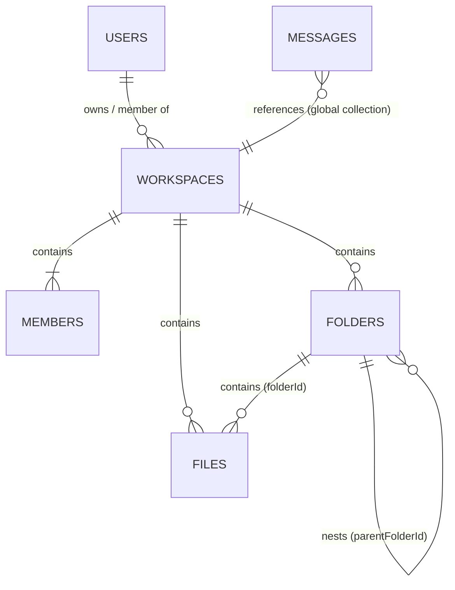

# CodeCraft — Data Model Architecture & Schema Audit

## 1. Overview & Data Scope

This document specifies the actual, verified data model of the local **CodeCraft** application as discovered through static code inspection of the Next.js and Firebase implementation.

The purpose of this document is to establish a strict boundary between:
1. **Persistent Metadata & Permissions** (Stored in Firestore)
2. **Realtime Collaborative State** (Targeted for Yjs + WebSockets in Phase 3)
3. **Durable File Backups & Snapshots** (Persistence lifecycle)

---

## 2. Verified Firestore Schema & Collections

### 2.1 Collection: `users`
- **Document Path:** `users/{uid}`
- **Legacy Fallback:** Previously supported `users/{email}`; all active writes now target `users/{uid}`.
- **Purpose:** User account profiles, preferences, and workspace invitation inboxes.
- **Access Model:**
  - Owner/User: Read/Write own document (`auth.currentUser.uid === uid`).
  - Other Authenticated Users: Queryable by email prefix for workspace invitations.
- **Verified Fields:**
  | Field | Type | Description |
  | :--- | :--- | :--- |
  | `uid` | string | Firebase Auth User ID (canonical key). |
  | `email` | string | User's verified email address. |
  | `displayName` | string | Profile display name (defaults to "Coder" or Google name). |
  | `photoURL` | string | Avatar URL (defaults to `/robotic.png`). |
  | `authProvider` | string | `"email"` or `"google"`. |
  | `createdAt` | serverTimestamp | Account registration timestamp. |
  | `lastLogin` | serverTimestamp | Last login timestamp. |
  | `twoFactorEnabled`| boolean | Flag for 2FA (default `false`). |
  | `workspaces` | map | Legacy workspace lookup map `{}`. |
  | `invites` | string[] | Array of `workspaceId` strings representing pending invitations. |
  | `settings` | map | Editor settings: `{ theme, fontSize, showLineNumbers, aiSuggestions }`. |
  | `snippets` | array | Saved user snippets `[]`. |
- **Readers:** [`src/helpers/loginHelp.js`](file:///C:/Users/HP/Desktop/Colleborative_ai_based_code-editor-main/src/helpers/loginHelp.js), [`src/components/Header.jsx`](file:///C:/Users/HP/Desktop/Colleborative_ai_based_code-editor-main/src/components/Header.jsx), [`src/components/Searchbar.jsx`](file:///C:/Users/HP/Desktop/Colleborative_ai_based_code-editor-main/src/components/Searchbar.jsx), [`src/app/profile/page.jsx`](file:///C:/Users/HP/Desktop/Colleborative_ai_based_code-editor-main/src/app/profile/page.jsx), [`src/components/InviteNotification.jsx`](file:///C:/Users/HP/Desktop/Colleborative_ai_based_code-editor-main/src/components/InviteNotification.jsx).
- **Writers:** [`src/helpers/signUpHelp.js`](file:///C:/Users/HP/Desktop/Colleborative_ai_based_code-editor-main/src/helpers/signUpHelp.js), [`src/helpers/loginHelp.js`](file:///C:/Users/HP/Desktop/Colleborative_ai_based_code-editor-main/src/helpers/loginHelp.js), [`src/components/Searchbar.jsx`](file:///C:/Users/HP/Desktop/Colleborative_ai_based_code-editor-main/src/components/Searchbar.jsx), [`src/components/InviteNotification.jsx`](file:///C:/Users/HP/Desktop/Colleborative_ai_based_code-editor-main/src/components/InviteNotification.jsx).

---

### 2.2 Collection: `workspaces`
- **Document Path:** `workspaces/{workspaceId}`
- **Purpose:** Top-level project container for collaborative coding.
- **Verified Fields:**
  | Field | Type | Description |
  | :--- | :--- | :--- |
  | `name` | string | Workspace display name. |
  | `isPublic` | boolean | Visibility flag (default `true`). |
  | `createdAt` | serverTimestamp | Timestamp of creation. |
  | `ownerId` | string | UID of user who created the workspace. |
- **Readers:** [`src/app/dashboard/page.jsx`](file:///C:/Users/HP/Desktop/Colleborative_ai_based_code-editor-main/src/app/dashboard/page.jsx), [`src/app/workspace/[workspaceId]/page.jsx`](file:///C:/Users/HP/Desktop/Colleborative_ai_based_code-editor-main/src/app/workspace/[workspaceId]/page.jsx), [`src/components/Header.jsx`](file:///C:/Users/HP/Desktop/Colleborative_ai_based_code-editor-main/src/components/Header.jsx).
- **Writers:** [`src/app/dashboard/page.jsx`](file:///C:/Users/HP/Desktop/Colleborative_ai_based_code-editor-main/src/app/dashboard/page.jsx) (`addDoc`, `deleteDoc`).
- **Deletion Behavior & Risk:** When a workspace document is deleted (`deleteDoc(doc(db, "workspaces", workspaceId))`), Firestore does **not** automatically delete subcollections (`members`, `folders`, `files`). Cascading deletion is currently missing in the application layer and must be addressed in future maintenance.

---

### 2.3 Subcollection: `workspaces/{workspaceId}/members`
- **Document Path:** `workspaces/{workspaceId}/members/{memberId}` (where `memberId` is `user.uid`).
- **Purpose:** Workspace membership and role-based access control.
- **Verified Fields:**
  | Field | Type | Description |
  | :--- | :--- | :--- |
  | `userId` | string | Firebase Auth User ID. |
  | `role` | string | Role definition: `"owner"`, `"contributor"`, or `"viewer"`. |
  | `joinedAt` | serverTimestamp | Timestamp when user joined or accepted invitation. |
- **Role Permissions in Client Code:**
  - `owner` / `contributor`: Allowed to add folders, add files, rename items, and delete items (`Navpanel.jsx:219, 326`).
  - `viewer`: Read-only file tree access; cannot create or delete files.
- **Readers:** [`src/components/Navpanel.jsx`](file:///C:/Users/HP/Desktop/Colleborative_ai_based_code-editor-main/src/components/Navpanel.jsx) (`onSnapshot`), [`src/components/Members.jsx`](file:///C:/Users/HP/Desktop/Colleborative_ai_based_code-editor-main/src/components/Members.jsx) (`onSnapshot`), [`src/app/dashboard/page.jsx`](file:///C:/Users/HP/Desktop/Colleborative_ai_based_code-editor-main/src/app/dashboard/page.jsx), [`src/components/Searchbar.jsx`](file:///C:/Users/HP/Desktop/Colleborative_ai_based_code-editor-main/src/components/Searchbar.jsx).
- **Writers:** [`src/app/dashboard/page.jsx`](file:///C:/Users/HP/Desktop/Colleborative_ai_based_code-editor-main/src/app/dashboard/page.jsx), [`src/app/profile/page.jsx`](file:///C:/Users/HP/Desktop/Colleborative_ai_based_code-editor-main/src/app/profile/page.jsx), [`src/components/Members.jsx`](file:///C:/Users/HP/Desktop/Colleborative_ai_based_code-editor-main/src/components/Members.jsx) (leave workspace via `deleteDoc`).

---

### 2.4 Subcollection: `workspaces/{workspaceId}/folders`
- **Document Path:** `workspaces/{workspaceId}/folders/{folderId}`
- **Purpose:** Hierarchical directory tree structure.
- **Verified Fields:**
  | Field | Type | Description |
  | :--- | :--- | :--- |
  | `name` | string | Folder display name. |
  | `parentFolderId`| string \| null | ID of parent folder; `null` if located at workspace root. |
- **Hierarchy Semantics:** Client recursively resolves `parentFolderId === folder.id`. Drag-and-drop modifies `parentFolderId` with an ancestry guard (`isDescendant`) to prevent cycles.
- **Readers:** [`src/components/Navpanel.jsx`](file:///C:/Users/HP/Desktop/Colleborative_ai_based_code-editor-main/src/components/Navpanel.jsx) (`onSnapshot`).
- **Writers:** [`src/components/Navpanel.jsx`](file:///C:/Users/HP/Desktop/Colleborative_ai_based_code-editor-main/src/components/Navpanel.jsx) (`addDoc`, `updateDoc`, `deleteDoc`).

---

### 2.5 Subcollection: `workspaces/{workspaceId}/files`
- **Document Path:** `workspaces/{workspaceId}/files/{fileId}`
- **Purpose:** File metadata and current durable textual content.
- **Verified Fields:**
  | Field | Type | Description |
  | :--- | :--- | :--- |
  | `name` | string | File name including extension (e.g., `index.js`, `main.py`). |
  | `folderId` | string \| null | ID of parent folder; `null` if located at workspace root. |
  | `workspaceId` | string | Parent workspace identifier. |
  | `content` | string | Full text content of the file. |
- **Readers:**
  - Metadata: [`src/components/Navpanel.jsx`](file:///C:/Users/HP/Desktop/Colleborative_ai_based_code-editor-main/src/components/Navpanel.jsx) (`onSnapshot` on files collection).
  - Content: [`src/components/Editor.jsx`](file:///C:/Users/HP/Desktop/Colleborative_ai_based_code-editor-main/src/components/Editor.jsx) (`onSnapshot` on specific file document).
- **Writers:**
  - Creation/Movement: [`src/components/Navpanel.jsx`](file:///C:/Users/HP/Desktop/Colleborative_ai_based_code-editor-main/src/components/Navpanel.jsx).
  - Content: [`src/components/Editor.jsx`](file:///C:/Users/HP/Desktop/Colleborative_ai_based_code-editor-main/src/components/Editor.jsx) via debounced `updateDoc(fileRef, { content })`.

---

### 2.6 Collection: `messages` (Chat)
- **Document Path:** `messages/{messageId}` (Global root collection).
- **Purpose:** In-workspace chat messages and AI queries.
- **Verified Fields:**
  | Field | Type | Description |
  | :--- | :--- | :--- |
  | `workspaceId` | string | ID of associated workspace. |
  | `userId` | string | Sender's Firebase Auth UID. |
  | `text` | string | Message body. |
  | `imageUrl` | string | Sender's avatar image URL. |
  | `createdAt` | serverTimestamp | Message creation timestamp. |
  | `isAI` | boolean \| undefined | Flag indicating an automated AI response. |
- **Known Architectural Limitation:**
  - In [`src/components/Chat.jsx:36, 45-48`](file:///C:/Users/HP/Desktop/Colleborative_ai_based_code-editor-main/src/components/Chat.jsx), the application queries `collection(db, "messages")` globally ordered by `createdAt`, and filters by `msg.workspaceId === workspaceId` **on the client**.
  - **Risk:** Cross-workspace data leakage and high bandwidth consumption.
  - **Phase 3 Recommendation:** Migrate to subcollection `workspaces/{workspaceId}/messages/{messageId}` or enforce indexed Firestore queries (`where("workspaceId", "==", workspaceId)`).

---

## 3. Data Responsibility Classification

| Category | Description | Storage Engine | Current Implementation | Phase 3 Target |
| :--- | :--- | :--- | :--- | :--- |
| **Category A: Persistent Metadata** | Workspace info, membership, roles, folder hierarchy, file names, timestamps | Firestore | Firestore documents & subcollections | **Firestore** (Unchanged) |
| **Category B: Realtime Document State** | Keystrokes, CRDT updates, cursor positions, selections, awareness, presence | Future Yjs / WebSocket | Debounced Firestore `updateDoc` + Firebase RTDB for cursors | **Yjs + WebSocket** |
| **Category C: Persistent File Content** | Cold storage of file text, snapshots, backups | Firestore | Full string in `workspaces/{id}/files/{id}.content` | **Firestore Snapshots** (Debounced from Yjs server) |

---

## 4. File Identity Model & Invariants

To enable conflict-free real-time collaboration with Yjs, file identity must remain stable across user actions:

1. **Document Identity Tuple:** A collaborative editing session is uniquely and immutably identified by:
   $$\text{Room ID} = \text{workspace:}\{workspaceId\}\text{:file:}\{fileId\}$$
2. **Rename Invariant:** Changing `file.name` (e.g., `test.js` $\to$ `utils.js`) modifies only the Firestore metadata document. The `fileId` remains constant, and active Yjs collaboration sessions are **not** disrupted or recreated.
3. **Move Invariant:** Moving a file to a different folder modifies only `folderId`. The `fileId` remains constant.
4. **Delete / Recreate Invariant:** Deleting a file permanently invalidates `fileId`. Creating a new file with the identical name assigns a new, unique `fileId` and instantiates an independent collaboration room.
