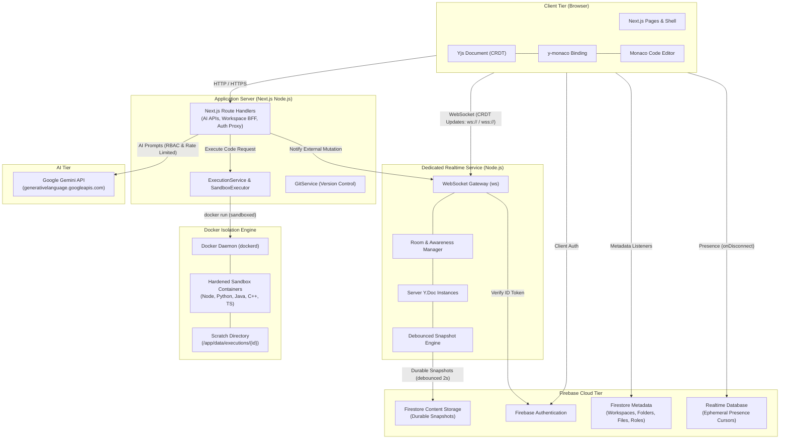

# CodeCraft — Realtime Collaboration & Execution Architecture

## 1. Executive Summary

This document describes the production architecture for real-time, conflict-free collaboration and secure code execution in CodeCraft. It establishes system boundaries, deployment topology, security policies, and performance characteristics for **Yjs**, **y-monaco**, a dedicated **WebSocket Collaboration Server**, **Docker Sandbox Execution**, and **Firebase** backend infrastructure.

---

## 2. System Architecture & Component Separation

### 2.1 Separation of Responsibilities

| Subsystem | Primary Responsibilities | Technologies |
| :--- | :--- | :--- |
| **Next.js Web App** | UI layout, component rendering, authentication state, workspace settings, file tree navigation, AI prompt orchestrator | React, Next.js 15, Tailwind CSS, Chakra UI |
| **Editor Layer** | Code editing, syntax highlighting, language detection, formatting | Monaco Editor (`@monaco-editor/react`), `y-monaco` |
| **Collaboration Service** | WebSocket connection handling, token authentication, room lifecycle, CRDT sync, cursor presence/awareness, debounced Firestore snapshotting, connection limits, heartbeat monitoring | Node.js, `y-websocket`, `yjs`, `ws` |
| **Execution Service** | Hardened containerized code execution, non-root runner isolation, scratch volume management, cancellation lifecycle, resource bounds | Docker Engine, `SandboxExecutor`, `ExecutionService` |
| **Firebase Cloud Tier** | User identity, persistent workspace metadata, membership permissions, durable file snapshots, ephemeral cursor presence | Firebase Auth, Google Cloud Firestore, Firebase Realtime Database |
| **AI Integration** | Chat assistant, code documentation generation, syntax error fixing, test harness execution | Google Gemini API via authorized Next.js server route handlers |
| **Version Control** | Isolated workspace git repositories, commit history, branch management | Pure Node.js `GitService` (`data/git/workspaces/`) |

---

## 3. Realtime Collaboration Architecture (Yjs & WebSocket)

### 3.1 Document State & Convergence
- **CRDT Foundation**: Each document is represented as a Yjs `Y.Doc` containing a shared text type (`Y.Text`). Keystrokes are converted to atomic CRDT operations that commute without merge conflicts.
- **WebSocket Protocol**: Client communicates with the collaboration service using the binary `y-websocket` protocol.
- **Debounced Persistence**: Keystrokes are accumulated in-memory on the collaboration server and flushed to Cloud Firestore after a configurable debounce interval (default: 2000ms), eliminating continuous database write traffic.
- **Room Lifecycle & Concurrency**:
  - Connection bounds: Room-level connection limits (`maxClientsPerRoom`) and server-wide connection caps (`maxTotalConnections`).
  - Active heartbeat: Ping/pong frames sent every 30 seconds; unresponsive sockets are terminated immediately to prevent socket exhaustion.
  - External Mutation Ingestion: When external processes (e.g. AI agent or Git branch switch) update files, mutations are ingested via `POST /notify-mutation` with expected-content conflict checks (returning 409 on stale base content).

### 3.2 Workspace Presence & Cursor Tracking
- Ephemeral cursor coordinates are published to Firebase Realtime Database (`workspaces/{workspaceId}/cursors/{userId}`).
- Protected by `database.rules.json`: users can only write to their own cursor path (`auth.uid === $userId`) and data is strictly validated against schema boundaries.
- Graceful disconnects and abrupt drops (browser crashes, network drops) are automatically cleaned up via `onDisconnect(cursorRef).remove()`.

---

## 4. Code Execution Sandbox Architecture

CodeCraft replaces legacy external execution APIs with a local, hardened **Docker Sandbox**:

### 4.1 Host Execution Service & Container Lifecycle
1. **Early Execution Identifier**: A client or caller generates an `executionId` upfront. The executor registers the in-flight execution in `activeExecutions` prior to spawning containers, enabling immediate cancellation while the container is spinning up.
2. **Per-Execution Isolation**:
   - For each run, an ephemeral directory `/app/data/executions/{executionId}` is created with mode `0o775`.
   - Source files are written to the scratch directory.
   - A non-root runner container is spawned with the scratch directory mounted into the container.
3. **Execution Limits & Resource Bounds**:
   - **Timeout**: Strict execution deadline (default 10s–30s) enforced by timers; processes exceeding limits are SIGKILLed.
   - **Memory**: Hard container memory cap (default 256MB–512MB).
   - **CPU**: Quota capped (e.g., `--cpus=1.0`).
   - **Process Table Limit**: `--pids-limit=64` to prevent fork bombs.
   - **Network**: `--network=none` to prevent containerized code from making arbitrary outbound network requests or scanning internal services.
   - **User Security**: Runs as non-root UID/GID dynamically resolved by `getExecutionContainerUser()`.
4. **Cleanup Guarantee**: When execution finishes (or is cancelled), the container is forcefully stopped and removed (`docker rm -f`), and the scratch directory is deleted recursively. Completed execution states are retained in a short-lived cache to prevent invalid post-completion cancellation.
5. **Runtime Support**:
   - JavaScript (`node:22-alpine`)
   - TypeScript (Node 22 native `--experimental-strip-types`, zero external loader dependencies)
   - Python (`python:3.11-alpine`)
   - Java (`eclipse-temurin:21-alpine`)
   - C++ (`gcc:13-alpine`)

---

## 5. Security & Authorization Policy

1. **Token Verification**: Handshakes and API requests require verified Firebase ID tokens.
2. **Workspace Authorization**: All route handlers verify workspace membership and role permissions (owner, contributor, viewer). AI endpoints enforce rate limiting and contributor-level role checks for mutating operations.
3. **AI Chat Impersonation Defense**: Direct client writes of `userId: "AI_BOT"` to Firestore messages are rejected by `firestore.rules`. AI responses must be generated and signed server-side by `/api/getChatResponse`.
4. **Agent Sandbox Defense**: Agent `run_tests` tool strictly rejects command injection and executes language test harnesses exclusively within the Docker sandbox.

---

## 6. Deployment Topology

1. **Application Server (Next.js)**:
   - Hosts frontend UI, SSR, API route handlers, AI agent orchestration, Git service, and Docker sandbox executor.
   - Deployed on AWS EC2 or ECS with EC2 launch type to access `/var/run/docker.sock`.
2. **Collaboration Server (Node.js)**:
   - Long-lived WebSocket process maintaining active `Y.Doc` instances and debounced Firestore snapshotters.
   - Runs on port 1234, fronted by ALB routing `/collab` WebSocket connections.
3. **Firebase Cloud Tier**:
   - Manages Firebase Auth, Firestore document persistence, and RTDB presence.
