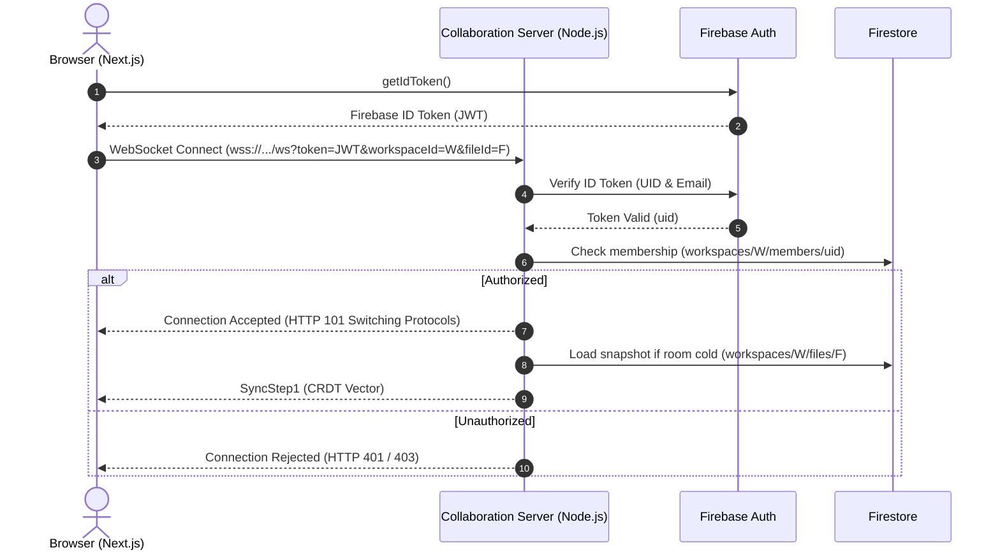

# CodeCraft — Realtime Collaboration Contract & Interface Specification

## 1. Overview

This document specifies the conceptual interface contract for Phase 3 real-time collaboration. It defines the protocol boundaries, document lifecycle, identity model, and connection semantics required when integrating Yjs, y-monaco, and WebSockets into the CodeCraft architecture.

> [!IMPORTANT]
> This document defines **interfaces and contracts only**. No Yjs dependencies, WebSockets, or runtime connection scripts are implemented during Phase 2.

---

## 2. Document Identity & Room Naming

A real-time collaborative document is strictly file-scoped. Workspaces contain collections of independent documents rather than a single monolithic shared state.

### 2.1 Canonical Room Identifier
Every collaborative session corresponds to an isolated room name:
```
room = `workspace:${workspaceId}:file:${fileId}`
```

### 2.2 Invariants
1. **Granularity:** Document synchronization is scoped strictly to a single `fileId`.
2. **Immutability:** Renaming or moving a file across folders does not change `fileId` or alter the active room name.
3. **Isolation:** Users connected to `fileA` receive zero network events or CRDT updates for `fileB`.

---

## 3. Conceptual TypeScript Interfaces (Target Specification for Phase 3)

The following interface contracts illustrate the target boundaries between the Next.js client, Monaco editor, and the collaboration service.

```typescript
/**
 * Canonical identifier for a collaborative document.
 */
export interface DocumentIdentity {
  readonly workspaceId: string;
  readonly fileId: string;
}

/**
 * User presence and awareness state broadcasted across the room.
 */
export interface UserPresence {
  readonly uid: string;
  readonly displayName: string;
  readonly color: string;
  readonly cursor: {
    readonly lineNumber: number;
    readonly column: number;
  } | null;
  readonly selection: {
    readonly startLineNumber: number;
    readonly startColumn: number;
    readonly endLineNumber: number;
    readonly endColumn: number;
  } | null;
  readonly lastActive: number;
}

/**
 * Connection states for the collaboration provider.
 */
export type ConnectionStatus = "disconnected" | "connecting" | "connected" | "error";

/**
 * Core collaboration document session contract.
 */
export interface CollaborationSession {
  readonly identity: DocumentIdentity;
  readonly status: ConnectionStatus;

  /**
   * Establishes authenticated WebSocket connection to the collaboration service.
   * Passes the Firebase ID token in the connection handshake.
   */
  connect(authToken: string): Promise<void>;

  /**
   * Disconnects cleanly and unbinds Monaco editor.
   */
  disconnect(): void;

  /**
   * Binds Monaco editor instance to the shared Y.Text type.
   */
  bindMonaco(editor: any): void;

  /**
   * Updates local cursor awareness state.
   */
  setLocalPresence(presence: Partial<UserPresence>): void;

  /**
   * Returns read-only current textual content.
   */
  getTextContent(): string;
}

/**
 * Persistence contract executed on the server side to store durable snapshots.
 */
export interface DocumentPersistenceProvider {
  /**
   * Fetches latest durable content from Firestore when room is cold.
   */
  loadInitialContent(identity: DocumentIdentity): Promise<string>;

  /**
   * Flushes debounced Yjs document snapshot to Firestore.
   */
  persistSnapshot(identity: DocumentIdentity, content: string): Promise<void>;
}
```

---

## 4. Authentication & Handshake Protocol

The WebSocket connection to the collaboration server must be authenticated at handshake time:



### Verification Criteria:
- Tokens must be cryptographically validated prior to establishing the room connection.
- Anonymous or unverified connections are dropped immediately.
- The server checks whether `userId` is an active member of `workspaceId` before permitting room join.

---

## 5. Migration Strategy: Debounced Firestore to Yjs

Currently, [`src/components/Editor.jsx`](file:///C:/Users/HP/Desktop/Colleborative_ai_based_code-editor-main/src/components/Editor.jsx) writes full text strings directly to Firestore on an 800ms debounce.

### Target Architecture in Phase 3:
1. **Local Keystroke:** User types into Monaco $\to$ `ymonaco` immediately updates local `Y.Text` CRDT structure (zero latency).
2. **Realtime Broadcast:** WebSocket distributes CRDT binary updates (`Uint8Array`) to connected peers.
3. **Persistence Scheduler:** The Collaboration Server buffers incoming updates and writes a debounced snapshot to Firestore (`workspaces/{workspaceId}/files/{fileId}`) every 3–5 seconds of inactivity.
4. **Decoupling:** Direct client `updateDoc` calls from the browser to Firestore for file content are completely eliminated.
